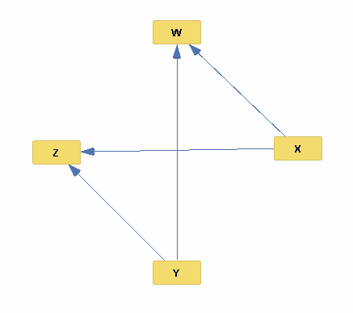

#  Assignment 2: Back Doors, Do, and other Funny Sounding Things
###  Jimmy Byrne, J Goocher, John Scott, and Jackson Watkins

##  Problem 1

###  Part 1
Using Tetrad, navigate to the menu and choose Pipelines > Load Data and Search. Double click the Data module to load one of the datasets, and then use the PC All algorithm (with default parameters) to search for the network structure within that data.

Once you've done this for each of the datasets, record the following in your report:

1.  Record the graph recovered by Tetrad's structure learning (which examines only independence relationships) in your report.
>  

2.  Tetrad will be unable to orient some of the edges, in which observationally equivalence edges will be represented with undirected edges. Explain why, in each dataset, those edges were not able to be oriented.
>  Tetrad was unable to determine the causality between exercise and sleep in the study_study dataset. This could be caused merely by sampling variation or the details of the experiment obfuscating the relationship of exercise causing sleep.

###  Part 2
Using your knowledge about heterogeneous datasets, deduce the *true* network structure in the observational / un-intervened model by combining clues from each of the studies and pieces of background knowledge individually. Record the true model in your report and explain your steps in deducing it.
>  The links X -> Z and Y -> Z were present in all datasets, so we added these first. Given the background knowledge we were also knew X -> W. The only possible link not included was W -> Z while logically possible this was only present in one of the datasets.

##  Problem 2

Suppose we have only observational data as the network parameters in the model above. Determine, and record in your report, the following:

1.  If the query is identifiable, provide the set of variables that serves as a back-door admissible adjustment set. Otherwise, indicate that the query is not identifiable.

2.  If such a set of variables can be found, write the adjustment formula that would be used to compute the causal query from the observational parameters.

1\.  *P*(*Z*|*do*(*X*))
>  1.  S = {C}, S = {A} where S are backdoor admissible sets
>  2.  sum over c: P(Z=z|X=x, C=c)P(C=c)

2\.  *P*(*B*|*do*(*A*))
>  1.  S = {Y}, S = {Z} where S is a backdoor admissible set
>  2.  sum over y: P(B=b|A=a, Y=y)P(Y=y) on S = {Y}

3\.  *P*(*Z*|*do*(*C*))
>  1.  S = {} where S is the backdoor admissible set. The backdoor criterion is not applicable because all spurious paths from C -> Z are blocked when C is intervened upon.

4\.  *P*(*Z*|*do*(*A*))
>  1.  S = {C} where S is a backdoor admissible set.
>  2.  sum over c: P(Z=z|A=a,C=c)P(C=c)

##  Problem 3

Using the model structure and datasets specified above, you are to produce a Python script (using the Pomegranate library) that computes the following.

1.  You are attempting to validate your observational model by comparing queries in both observational and experimental settings.

*  To do so, produce a script `model_validator.py` that computes *P*(*Y* = 1|*do*(*X* = *x*)) ∀*x* ∈ *X* (i.e., the causal effects of both drugs) from BOTH the observational and the experimental data.

*  Record your strategy for doing so and the results of how those quantities compare across the datasets in your report.
>  TODO

2.  Suppose a patient presents with covariates *W* = 0, *M* = 0.

*  Determine the optimal treatment to assign to this patient, showing the computations in a script `treatment_suggestion.py`. Record your strategy for making this determination in your report.
>  TODO

*  In the same script, determine the rate by which doctors "in the wild" are prescribing the optimal treatment for patients of this type (i.e., those for which *W* = 0, *M* = 0). Record your strategy for making this determination in your report.
>  TODO
