# Assignment 4: MAB About You

## Jimmy Byrne, J Goocher, John Scott, and Jackson Watkins

## Problem 1: The Greedy Player

1. **Expectations:** in a sentence or two, describe how you expect this agent to perform on the task at hand.

> The agent would choose one of the four ads with the highest action value - which is the cumulative reward over the total amount of trials for a specific ad.

2. **Sim Results:** run the simulation script with *only* the `Greedy_Agent` (i.e., modify the `agents` list in the simulation configurations), capture the resulting graph, and add it to your report.

> 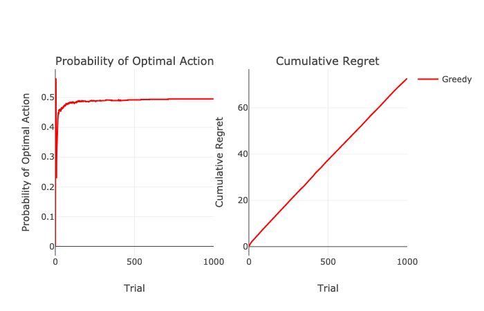

## Problem 2: The *ϵ*-Greedy Player

1. **Expectations:** in a sentence or two, describe how you expect this agent to perform with values of *ϵ* ∈ {0.05,0.10,0.15}.

> For each value of *ϵ* above, this agent would have a small 0.05, 0.10, and 0.15 probability of choosing a random ad. A majority of the time, the agent would take the greedy approach 0.95, 0.90, and 0.85 chance in choosing an ad.

2. **Sim Results:** run the simulation script with 3 separate versions of the `Epsilon_Greedy_Agent`, parameterized by the 3 separate values of *ϵ* mentioned above, capture the resulting graph, and add it to your report.

> *ϵ* = 0.05
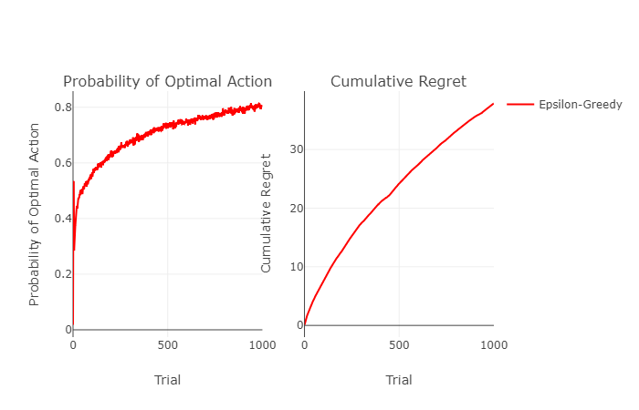
*ϵ* = 0.10
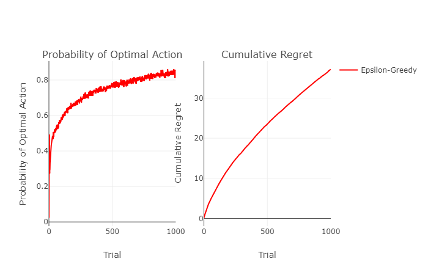
*ϵ* = 0.15
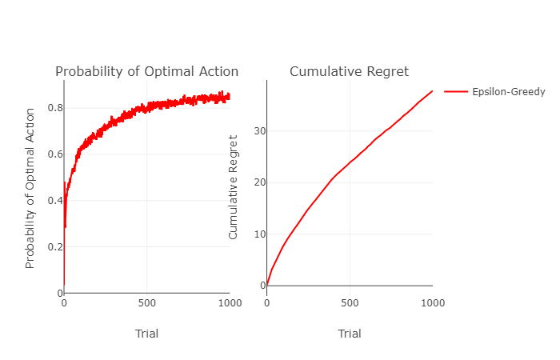

## Problem 3: The *ϵ*-First Player

1. **Expectations:** in a sentence or two, describe how you used knowledge of a finite-time horizon *T* to choose and then test several values of *ϵ*.

> Using a finite-time horizon we could randomly choose ads with a random *ϵ* for a certain amount of trials and then exploit the greedy policy.

2. **Sim Results:** run the simulation script with 3 separate versions of the `Epsilon_First_Agent`, parameterized by the 3 separate values of *ϵ* that you mentioned above, capture the resulting graph, and add it to your report.

> *ϵ* = 0.05
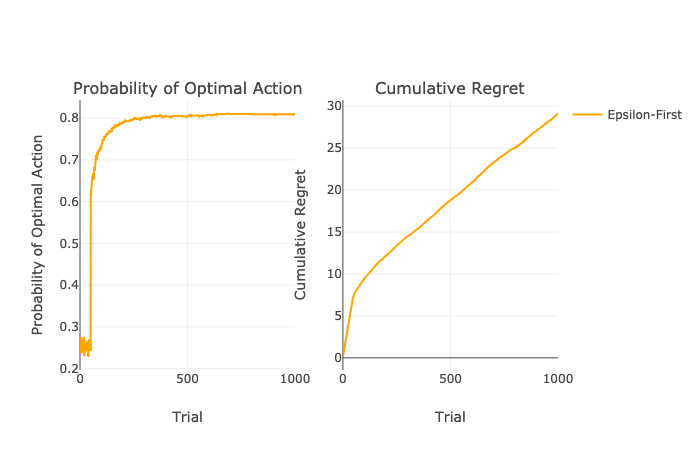
*ϵ* = 0.10
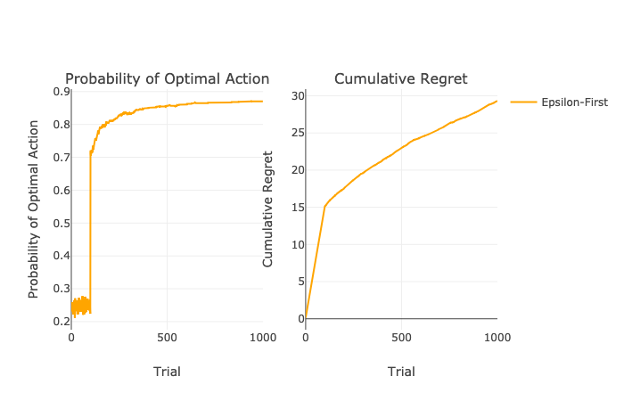
*ϵ* = 0.15
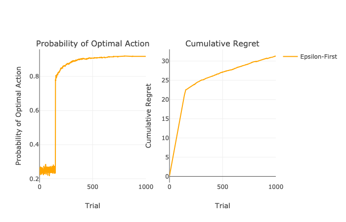

## Problem 4: The *ϵ*-Decreasing Player

1. **Expectations:** in a sentence or two, describe how you used simulated annealing to derive a **cooling schedule** for the decrease of *ϵ* over time (feel free to experiment here, and remark on your approach / findings).

> We would use simulated annealing to derive a **cooling schedule** for the decrease of *ϵ* by decreasing *ϵ* by a defined decay rate so as to allow for the agent to choose randomly less often as trials occur.

2. **Sim Results:** run the simulation script with 3 separate versions of the `Epsilon_Decreasing_Agent`, parameterized by the 3 separate cooling schedules that you mentioned above (these might be different by starting values of *ϵ*, rate of decrease, etc.), capture the resulting graph, and add it to your report.

> *ϵ* = 0.20
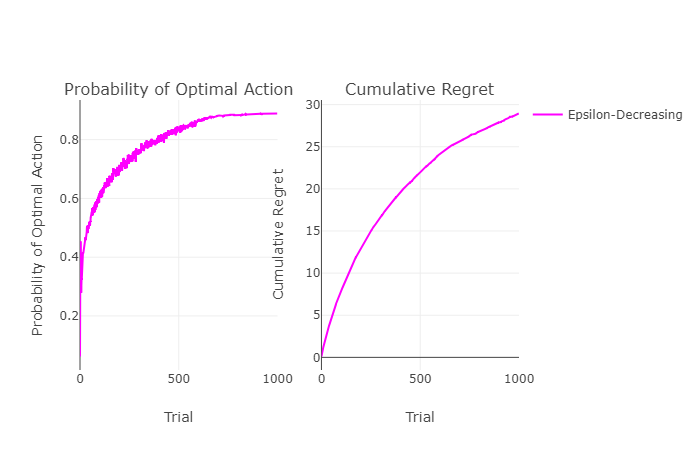
*ϵ* = 0.25
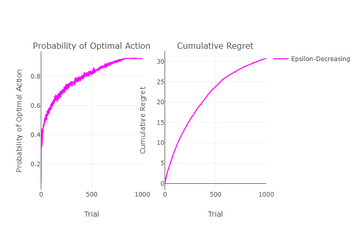
*ϵ* = 0.30
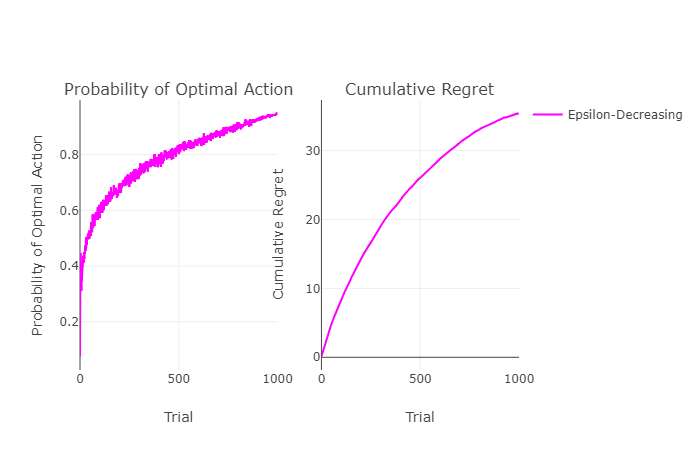

## Problem 5: The Thompson Sampling Player

1. **Expectations:** in a sentence or two, describe how you used implemented your Thompson Sampling bandit player.

> Our Thompson Sampling bandit player will throw darts given wins and losses from each ad and attempt to take the max beta value that is calculated from all 4 ads.

2. **Sim Results:** run the simulation script with the *best* versions of each of the previous 4 bandit players PLUS your new Thompson Sampling player. Record the graph and results in your report.

> Reward Signal Probabilities: P_R = [0.50, 0.60, 0.40, 0.30]
Greedy Agent: N/A
Epsilon Greedy Agent: *ϵ* = 0.15
Epsilon First Agent: *ϵ* = 0.10
Epsilon Decreasing Agent: *ϵ* = 0.20; decay_rate = 0.0003
Thompson Sampling Agent: N/A
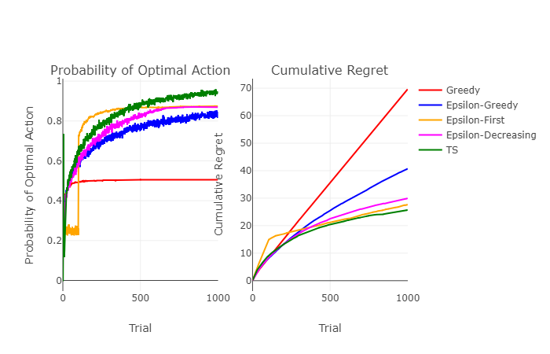

3. **Compare:** Lastly, rerun the simulations with reward signals that are very similar (i.e., ~1 − 2% away from one another), and see how this modification changes the results (to do so, modify the `P_R` list in `mab_sim.py`)

> Reward Signal Probabilities: P_R = [0.50, 0.51, 0.52, 0.53]
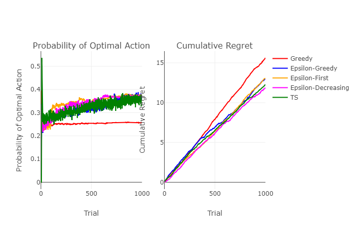

4. **Reflect:** how did these approaches compare? Comment on the strengths of your Thompson Sampler as it might perform vs. the others if you did *not know* or did *not have* a *finite* time horizon, *T*.

> The approach with the new reward signals (~1 − 2% away) for P_T would generate a larger variance in the probability of optimal action chosen and improve slightly in choosing the optimal action. If we did not know the time horizon, the Thompson Sampler agent could generate a beta value with a large variance causing it to explore other possible lower reward values rather than exploit high rewards. If there was no finite time horizon, the Thompson Sampler agent would never attempt to center over true rewards.
